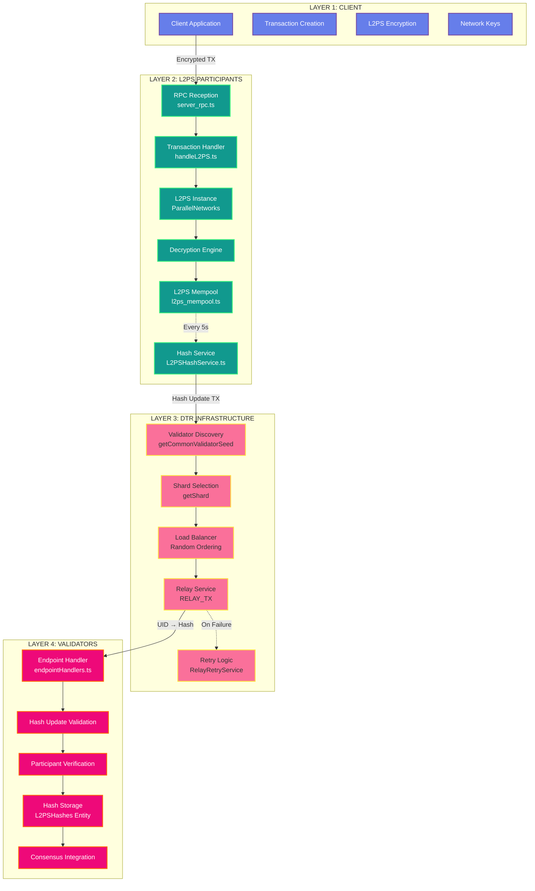
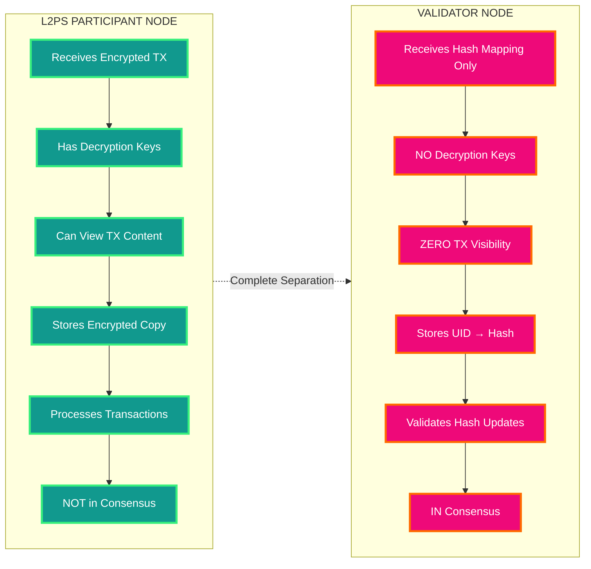
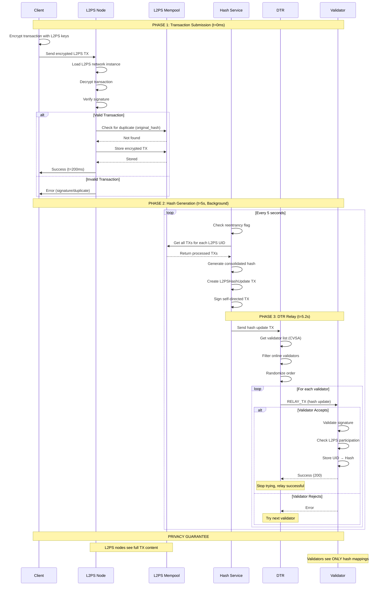
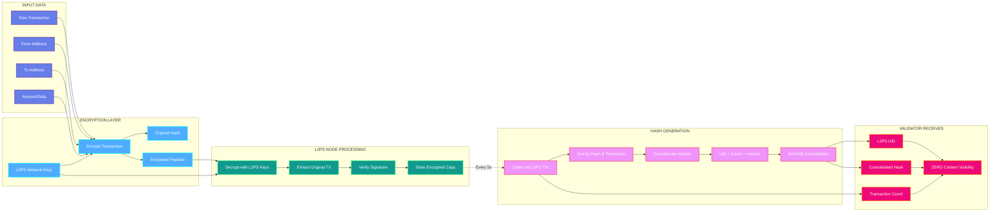
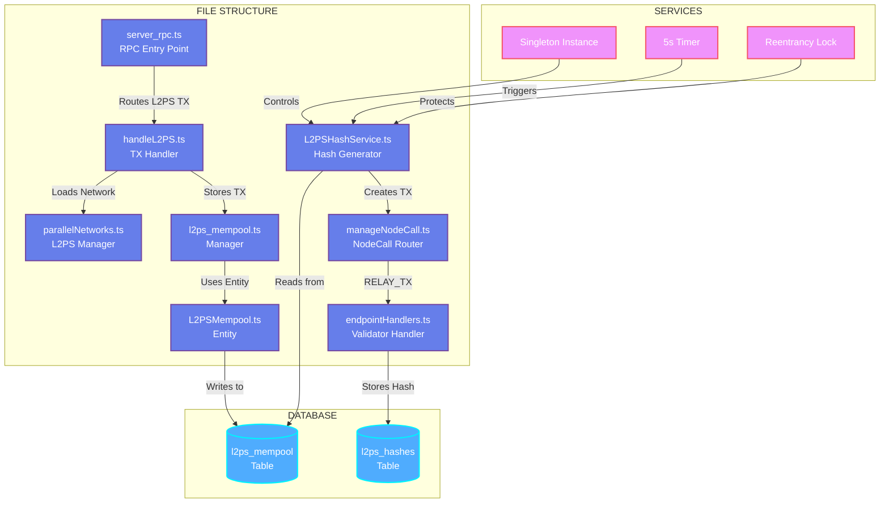
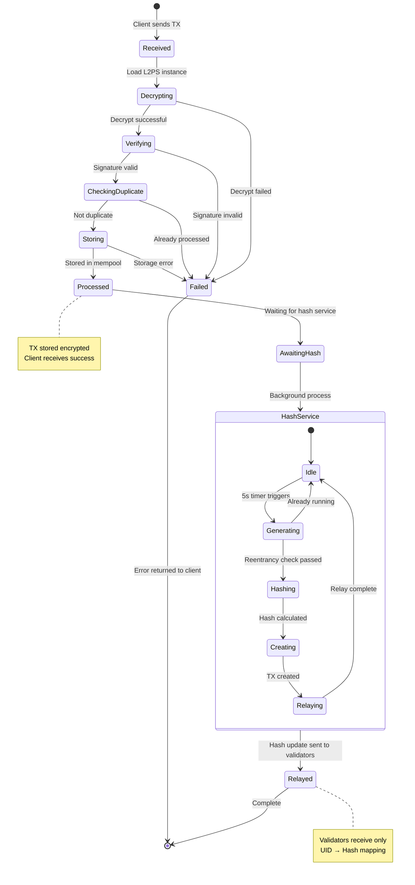
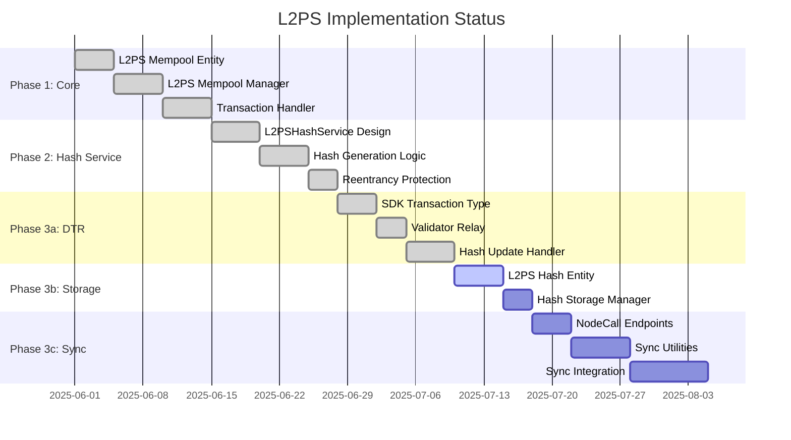
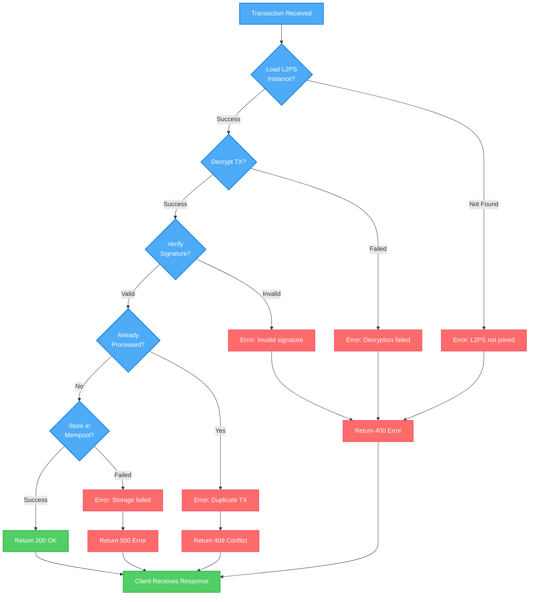
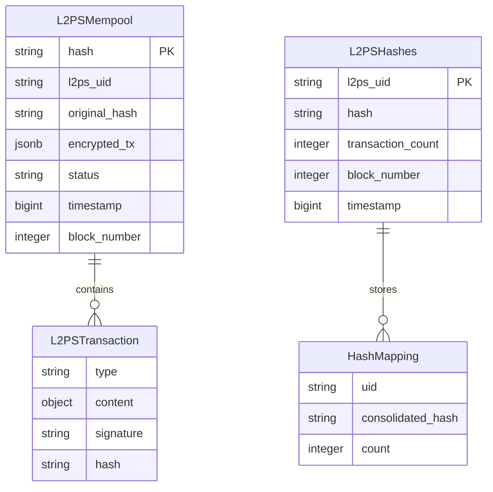

# L2PS Architecture - Mermaid Diagrams

## 1. Complete Transaction Flow

```mermaid
flowchart TB
    subgraph Client["CLIENT LAYER"]
        C1[Client Application]
        C2[Encrypt Transaction]
        C3[Sign with L2PS Keys]
    end

    subgraph L2PS["L2PS PARTICIPANT NODE (Non-Validator)"]
        L1[RPC Server]
        L2{Subnet Type?}
        L3[Load L2PS Instance]
        L4[Decrypt Transaction]
        L5[Verify Signature]
        L6{Valid?}
        L7[Check Duplicate]
        L8{Already Processed?}
        L9[(L2PS Mempool<br/>Encrypted Storage)]
        L10[Return Success]
        L11[Return Error]
    end

    subgraph Hash["HASH GENERATION SERVICE (Background - Every 5s)"]
        H1[L2PSHashService Timer]
        H2{Reentrancy Check}
        H3[Get Joined L2PS UIDs]
        H4[For Each UID]
        H5[Get All Transactions]
        H6[Generate Consolidated Hash]
        H7[Create L2PS Hash Update TX]
        H8[Sign Self-Directed TX]
    end

    subgraph DTR["DTR ROUTING LAYER"]
        D1[Get Validator List]
        D2[Filter Online Validators]
        D3[Randomize Order]
        D4[Try Each Validator]
        D5{Success?}
        D6[RELAY_TX Call]
    end

    subgraph Validator["VALIDATOR CONSENSUS LAYER"]
        V1[Receive Hash Update]
        V2[Validate TX Signature]
        V3{L2PS Participant?}
        V4[Store UID → Hash Mapping]
        V5[(L2PS Hash Storage)]
        V6[Include in Consensus]
        V7[Reject TX]
    end

    %% Client Flow
    C1 --> C2
    C2 --> C3
    C3 -->|Encrypted L2PS TX| L1

    %% L2PS Node Flow
    L1 --> L2
    L2 -->|L2PS Type| L3
    L3 --> L4
    L4 --> L5
    L5 --> L6
    L6 -->|Yes| L7
    L6 -->|No| L11
    L7 --> L8
    L8 -->|No| L9
    L8 -->|Yes| L11
    L9 --> L10
    L10 -->|Response| C1
    L11 -->|Error| C1

    %% Hash Service Flow
    H1 -.->|Every 5s| H2
    H2 -->|Not Running| H3
    H3 --> H4
    H4 --> H5
    L9 -.->|Read| H5
    H5 --> H6
    H6 --> H7
    H7 --> H8
    H8 --> D1

    %% DTR Flow
    D1 --> D2
    D2 --> D3
    D3 --> D4
    D4 --> D6
    D6 --> D5
    D5 -->|Yes| V1
    D5 -->|No - Try Next| D4

    %% Validator Flow
    V1 --> V2
    V2 --> V3
    V3 -->|Yes| V4
    V3 -->|No| V7
    V4 --> V5
    V5 --> V6

    %% Styling
    classDef clientStyle fill:#667eea,stroke:#764ba2,stroke-width:3px,color:#fff
    classDef l2psStyle fill:#11998e,stroke:#38ef7d,stroke-width:3px,color:#fff
    classDef hashStyle fill:#f093fb,stroke:#f5576c,stroke-width:3px,color:#fff
    classDef dtrStyle fill:#fa709a,stroke:#fee140,stroke-width:3px,color:#333
    classDef validatorStyle fill:#ee0979,stroke:#ff6a00,stroke-width:3px,color:#fff
    classDef storageStyle fill:#4facfe,stroke:#00f2fe,stroke-width:2px,color:#fff

    class C1,C2,C3 clientStyle
    class L1,L2,L3,L4,L5,L6,L7,L8,L10,L11 l2psStyle
    class L9 storageStyle
    class H1,H2,H3,H4,H5,H6,H7,H8 hashStyle
    class D1,D2,D3,D4,D5,D6 dtrStyle
    class V1,V2,V3,V4,V6,V7 validatorStyle
    class V5 storageStyle
```

## 2. Architecture Layers Overview

## 3. Privacy Model Comparison

## 4. Sequence Diagram: Transaction Lifecycle

## 5. Data Flow Diagram

## 6. Component Interaction Diagram

## 7. State Machine: Transaction States

## 8. Implementation Status

## 9. Error Handling Flow

## 10. Database Schema

---

## How to View These Diagrams

### Option 1: GitHub/GitLab
Push this file to GitHub or GitLab - they render Mermaid natively.

### Option 2: VS Code
Install the "Markdown Preview Mermaid Support" extension.

### Option 3: Online Viewer
Copy any diagram to https://mermaid.live

### Option 4: HTML Export
Use the provided HTML file (next section) to view all diagrams in browser.
