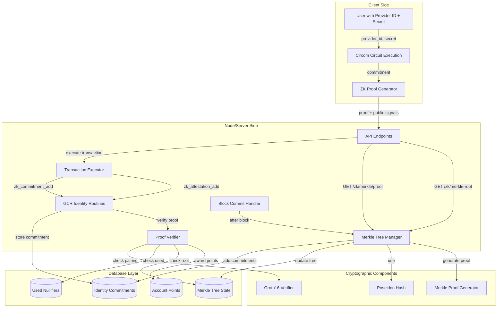
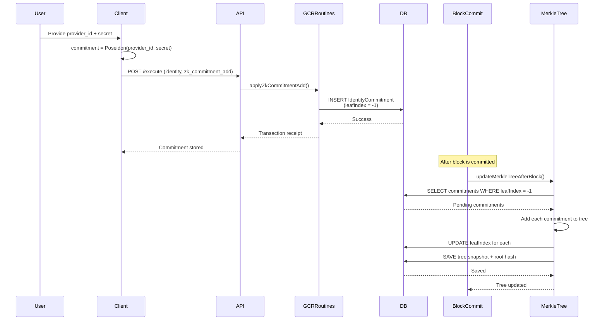
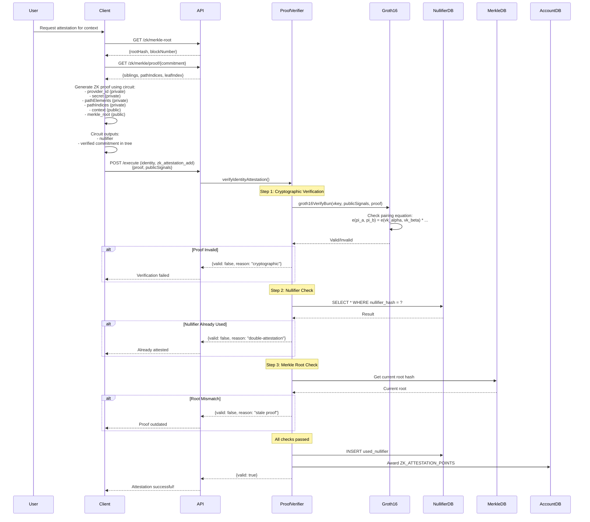
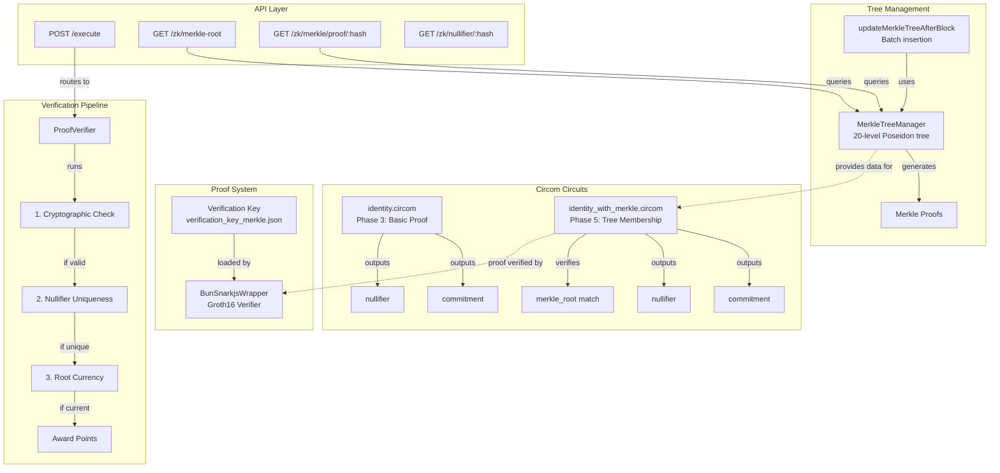
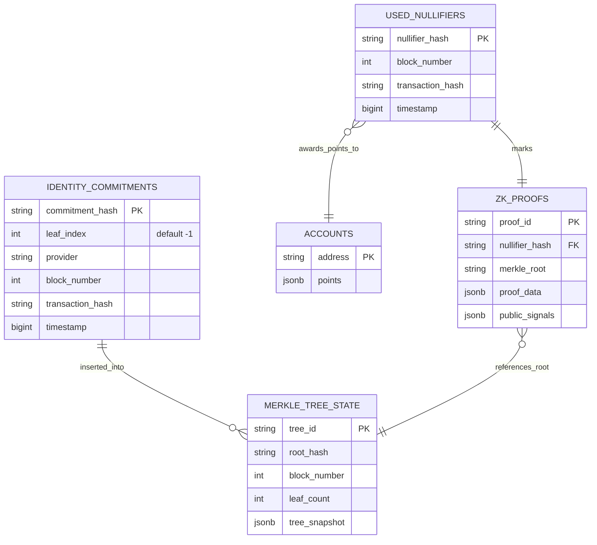

# ZK Identity System - Architecture Documentation

## Overview

This system implements **anonymous identity attestation** using Groth16 ZK-SNARKs with Merkle tree membership proofs. It enables users to prove they control a verified Web2 identity (GitHub, Twitter, etc.) without revealing which specific identity, while preventing double-attestations through nullifiers.

---

## MermaidJS Architecture Diagram



---

## Detailed Flow Diagrams

### 1. Commitment Creation Flow



### 2. Proof Generation and Verification Flow



### 3. Component Architecture



### 4. Data Model Relationships



### 5. Cryptographic Primitives Flow

```mermaid
graph LR
    subgraph "Inputs"
        ProviderID[Provider ID<br/>e.g., GitHub username]
        Secret[Secret<br/>User's private key]
        Context[Context<br/>e.g., vote_123]
    end

    subgraph "Poseidon Hashing"
        Hash1[Poseidon Hash]
        Hash2[Poseidon Hash]
        Hash3[Poseidon Hash - Tree]
    end

    subgraph "Outputs"
        Commitment[Commitment<br/>Public, in tree]
        Nullifier[Nullifier<br/>Unique per context]
        TreeNode[Tree Nodes<br/>Internal hashes]
    end

    ProviderID -->|input| Hash1
    Secret -->|input| Hash1
    Hash1 -->|output| Commitment

    ProviderID -->|input| Hash2
    Secret -->|input| Hash2
    Context -->|input| Hash2
    Hash2 -->|output| Nullifier

    Commitment -->|leaf| Hash3
    Hash3 -->|parent| Hash3
    Hash3 -->|output| TreeNode

    subgraph "Groth16 Circuit"
        CircuitInput[Private: provider_id, secret, path<br/>Public: context, merkle_root]
        CircuitLogic[Verify:<br/>1. commitment = H(provider_id, secret)<br/>2. nullifier = H(provider_id, secret, context)<br/>3. merkleProof valid<br/>4. merkleProof.root == merkle_root]
        CircuitOutput[Outputs:<br/>nullifier, merkle_root]

        CircuitInput --> CircuitLogic
        CircuitLogic --> CircuitOutput
    end

    Commitment -.->|proves knowledge of| CircuitInput
    Nullifier -.->|computed by| CircuitLogic
```

---

## System Components Detail

### Core Components

| Component | Location | Responsibility |
|-----------|----------|----------------|
| **identity_with_merkle.circom** | `src/features/zk/circuits/` | Circuit definition for ZK proofs with tree membership |
| **ProofVerifier** | `src/features/zk/proof/ProofVerifier.ts` | 3-step verification pipeline |
| **BunSnarkjsWrapper** | `src/features/zk/proof/BunSnarkjsWrapper.ts` | Bun-compatible Groth16 verifier |
| **MerkleTreeManager** | `src/features/zk/merkle/MerkleTreeManager.ts` | Global tree management (20 levels, Poseidon) |
| **updateMerkleTreeAfterBlock** | `src/features/zk/merkle/updateMerkleTreeAfterBlock.ts` | Batch commitment insertion after blocks |
| **GCRIdentityRoutines** | `src/libs/blockchain/gcr/gcr_routines/GCRIdentityRoutines.ts` | Transaction handlers for commitments and attestations |

### API Endpoints

| Endpoint | Method | Purpose |
|----------|--------|---------|
| `/execute` | POST | Submit commitment or attestation transaction |
| `/zk/merkle-root` | GET | Get current tree root for proof generation |
| `/zk/merkle/proof/:hash` | GET | Get Merkle proof for specific commitment |
| `/zk/nullifier/:hash` | GET | Check if nullifier has been used |
| `/` (with `method: "verifyProof"`) | POST | Quick proof verification |

### Database Tables

| Table | Purpose |
|-------|---------|
| **identity_commitments** | Stores all commitments with leaf indices |
| **merkle_tree_state** | Persists tree snapshot and root hash |
| **used_nullifiers** | Prevents double-attestations (PK on hash) |
| **accounts** | Stores user points awarded for attestations |

---

## Key Cryptographic Properties

### Privacy Guarantees
- **Provider ID Hidden:** Never transmitted, only used in circuit
- **Unlinkability:** Different nullifiers per context prevent tracking
- **Anonymity Set:** All users in global tree (can't determine which identity)

### Security Guarantees
- **Double-Attestation Prevention:** Nullifier PK constraint + database check
- **Proof Soundness:** Groth16 pairing verification (256-bit security)
- **Replay Protection:** Context-bound nullifiers
- **Membership Proof:** Merkle path verification in circuit

### Performance Characteristics
- **Tree Capacity:** 2^20 = 1,048,576 commitments
- **Proof Size:** ~128 bytes (3 curve points)
- **Verification Time:** ~5-10ms per proof
- **Tree Update:** Batch after each block (deterministic order)

---

## Configuration

### Environment Variables
```bash
ZK_ATTESTATION_POINTS=10      # Points awarded per valid attestation
ZK_MERKLE_TREE_DEPTH=20       # Tree levels (1M+ capacity)
ZK_MERKLE_TREE_ID="global"    # Tree identifier
```

### Setup Requirements
```bash
# One-time setup
bun run zk:setup-all

# Downloads:
# - Powers of Tau ceremony file (140MB)
# - Generates verification keys
# - Compiles circuits
```

### Key Files
- `src/features/zk/keys/verification_key_merkle.json` - Verification key (committed)
- `src/features/zk/keys/identity.zkey` - Proving key (gitignored, local)
- `src/features/zk/keys/powersOfTau28_hez_final_14.ptau` - Trusted setup (gitignored)

---

## Use Cases

### 1. Anonymous Airdrops
- Users prove they have verified identity without revealing which one
- Nullifier prevents claiming multiple times
- Anonymity set = all verified users

### 2. Private Voting
- One vote per identity per proposal
- Context = proposal ID (different nullifier per proposal)
- Vote cannot be linked to specific user

### 3. Reputation Systems
- Prove identity quality (e.g., GitHub with X followers)
- Without revealing exact account
- Accumulate points anonymously

---

## Testing

### Test Files
- `src/features/zk/tests/proof-verifier.test.ts` - Verification pipeline tests
- `src/features/zk/tests/merkle.test.ts` - Tree operations tests
- `src/tests/test_identity_verification.ts` - Circuit tests
- `src/tests/test_production_verification.ts` - Production proof validation

### Run Tests
```bash
bun test src/features/zk/tests/
```

---

## Future Enhancements

### Planned Features
- **Multiple Trees:** Separate trees per provider for privacy tiers
- **Recursive Proofs:** Aggregate multiple attestations
- **Range Proofs:** Prove account age or follower count ranges
- **Revocation:** Support for revoking compromised commitments

### Scalability Optimizations
- **Off-chain Tree:** Move tree to IPFS/Arweave for reduced DB load
- **Batch Verification:** Verify multiple proofs in single pairing
- **Lazy Tree Updates:** Update tree on-demand vs. after every block

---

## References

- **Groth16 Paper:** https://eprint.iacr.org/2016/260.pdf
- **Circom Documentation:** https://docs.circom.io/
- **Poseidon Hash:** https://www.poseidon-hash.info/
- **snarkjs Library:** https://github.com/iden3/snarkjs
- **Incremental Merkle Trees:** https://github.com/privacy-scaling-explorations/zk-kit

---

## Architecture Decisions

### Why Groth16?
- **Proof Size:** Smallest proof size (~128 bytes) vs. Plonk (~512 bytes)
- **Verification Speed:** Fastest verification (~5ms) vs. STARKs (~50ms)
- **Maturity:** Battle-tested in production (Zcash, Filecoin, Tornado Cash)

### Why Poseidon?
- **ZK-Friendly:** Designed for SNARK circuits (fewer constraints)
- **Performance:** ~10x faster than SHA256 in circuits
- **Security:** 128-bit security level, extensively analyzed

### Why 20-level Tree?
- **Capacity:** 1M+ users = sufficient for medium-scale deployments
- **Proof Size:** 20 siblings = reasonable proof generation time
- **Gas Efficiency:** Could verify on-chain if needed (20 hashes)

### Why Global Tree?
- **Maximum Anonymity:** All users in same anonymity set
- **Simplicity:** Single source of truth for commitments
- **Flexibility:** Context parameter allows per-use-case nullifiers

---

*Generated from zk_ids branch analysis*
